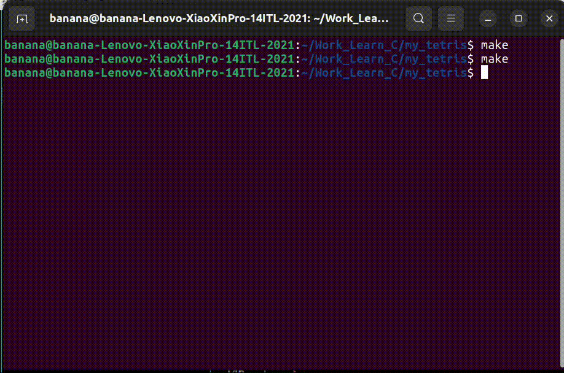

# MY_TETRIS

**终端内可运行的简单俄罗斯方块程序**!\
依赖`C++11`编写，使用`curses.h`库，编译时需使用`-lncurses`,
或者直接使用`make`命令进行编译运行。

**操作方法**：\
使用`a`左移，`b`右移，`w`变换形状，`s`快速下降，`q`退出游戏。

## 运行展示

## 如何构建文件
`g++ -o main main.cpp -lncurses`

### 有空会不定时更新
